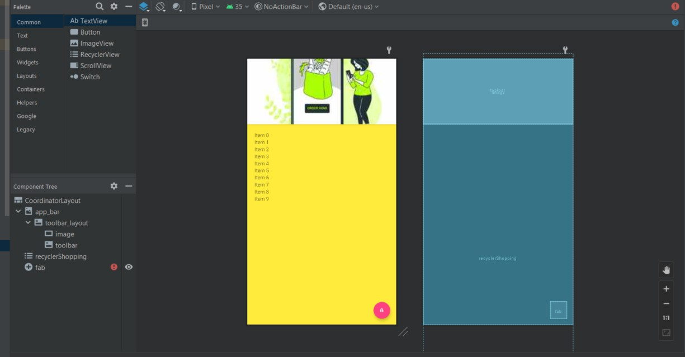
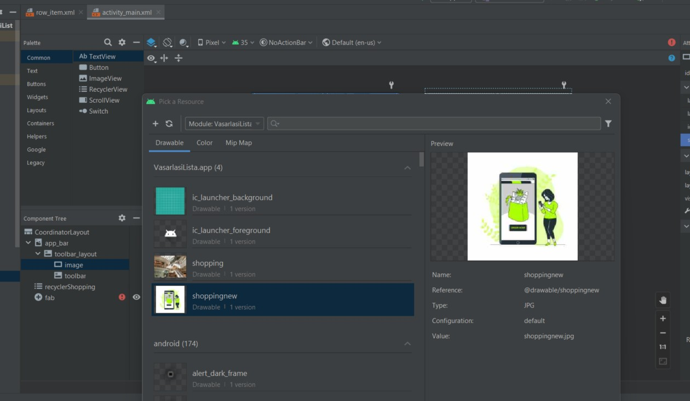
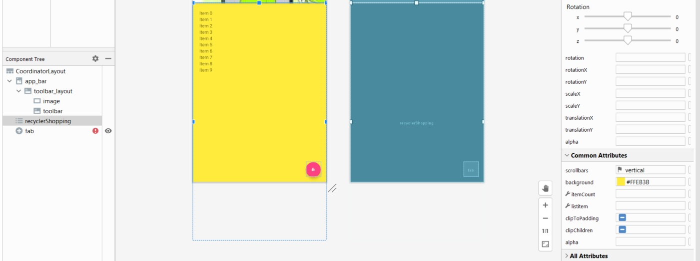
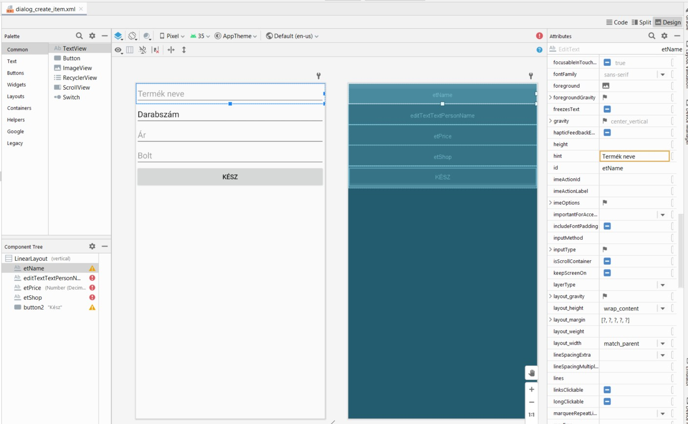
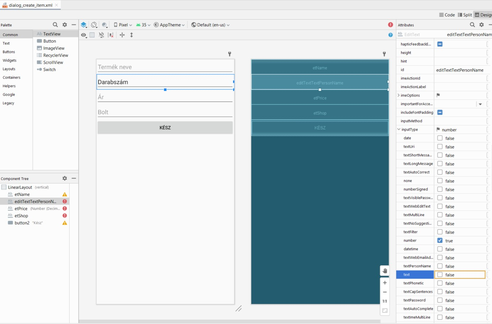
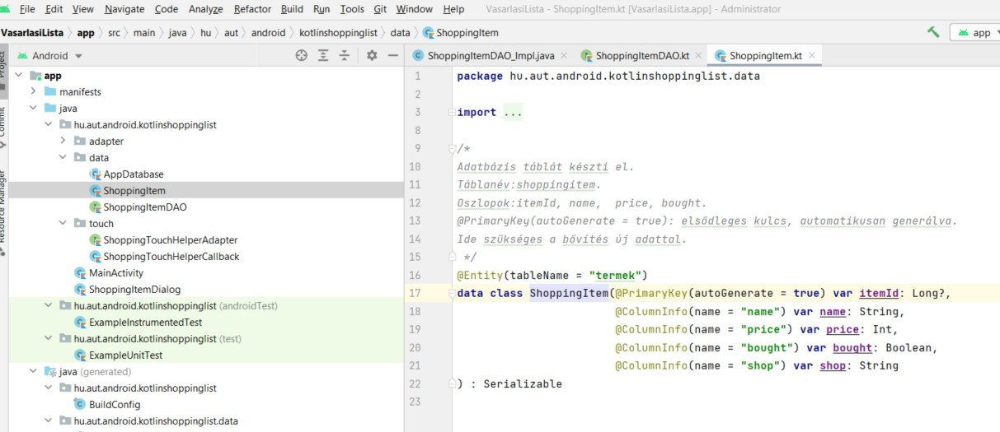
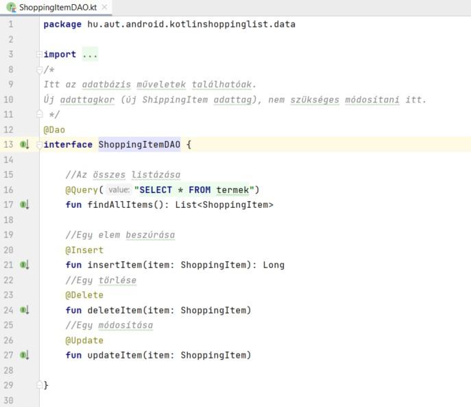
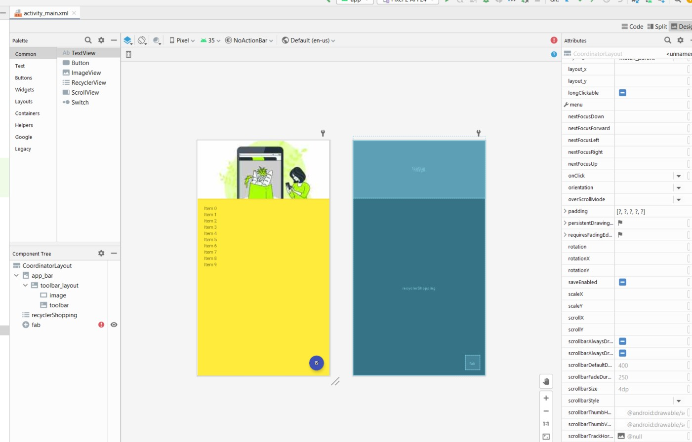
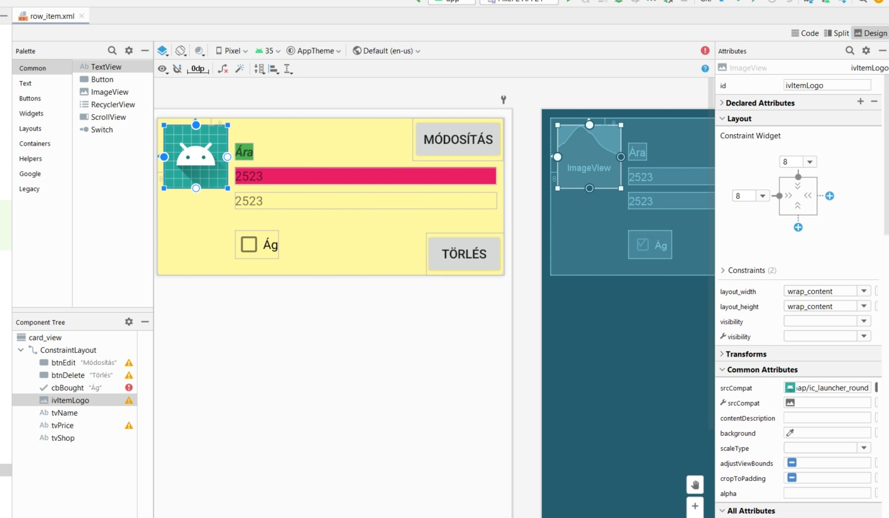

# rvque9-mobdev

# Kotlin Shopping List alkalmazás módosítása
***Bartók Péter László RVQUE9***

***III. évfolyam*** 

***Mérnökinformatikus, levelező***

---

1. [KotlinShoppingList alkalmazás módosítása](#kotlinshoppinglist-alkalmazás-módosítása)
   1. [Csomagnevek és tartalmazó mappa módosítása](#csomagnevek-és-tartalmazó-mappa-módosítása)
   2. [Háttérkép módosítása](#háttérkép-módosítása)
   3. [A háttér színének módosítása](#a-háttér-színének-módosítása)
   4. [A elfogadó gomb hozzáadás + magyarosítás + a darabszám input paraméterének megváltoztatása ](#Az-elfogadó-gomb-hozzáadás-magyarosítás-a-darabszám-input-paraméterének-megváltoztatása)
   5. [Adatbázis tábla név és adatbázis file módosítás](#adatbázis-tábla-név-és-adatbázis-file-módosítás)
   6. [Költséghozzáadó ikon változtatása](#költséghozzáadó-ikon-változtatása)
   7. [Költségtételt jelző címkék megváltoztatása](#költségtételt-jelző-címkék-megváltoztatása)

---


## Csomagnevet tartalmazó mappa módosítása

Az alkalmazásban először a csomagneveket és a tartalmazó mappa nevét módosítottam, a KotlinShoppinglist alkalmazást átneveztem VasarlasiLista névre.
A módosítások egy része a magyarosítás alapján történt.

---

## Háttérkép módosítása

A következő lépés az alkalmazás felső részében található kép módosítása volt.


A képet a következő helyre kellett bemásolni, hogy megtörténhessen a módosítás:

```
CostAccountant\app\src\main\res\drawable
```

A változtatást az activity_main.xml fájlban kellett végrehajtani. A folyamatot a következő kép szemlélteti:



---

## A háttér színének módosítása

A kép alatt található rész háttérszínét sárgára változtattam, szintén az activity_main.xml fájlban, ahogy a következő ábra mutatja:



Ezzel a lehetőséggel az alapértelmezetten elérhető színek között választhatunk. Csak teszt kedvéért választottam a sárgát. Meg olyan jól mutat:)


---

## A elfogadó gomb hozzáadás + magyarosítás + a darabszám input paraméterének megváltoztatása

Az új kiadás bevitelére szolgáló plain textek alapértelmezett szövegét magyar nyelvűre változtattam, dőlt betűvel látható. Sorrendben a következők lettek:
* Termék neve - vásárlás értéke
* Darabszám
* Ár
* Bolt
* Illetve egy kész gombot is beszúrtam.



Az Darabszám adattípusnak decimal lett.



---

## Adatbázis tábla átnevezése és az Adatbázisban a tábla nevének módosítása
Az adatbázis neve az AppDatabase-en belül shopping.db-ről termek.db-re válozott.




---

## Költséghozzáadó ikon változtatása

Az ikont a levél ikonról pipa jelre változtattam és megcseréltem a háttér színét is. jelre változtattam.



---

## Költségtételt jelző címkék megváltoztatása

A változtatásokat a row_item.xml fájlban kell elvégezni. A feliratok szövege és címe mellett más lett a háttér és szövegek színe is.




---
